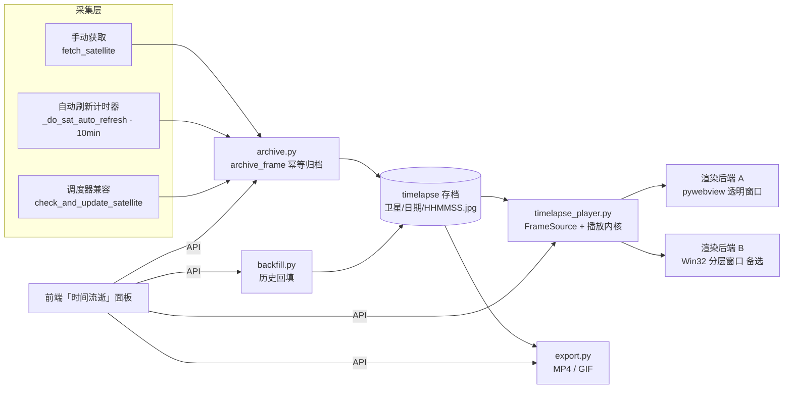
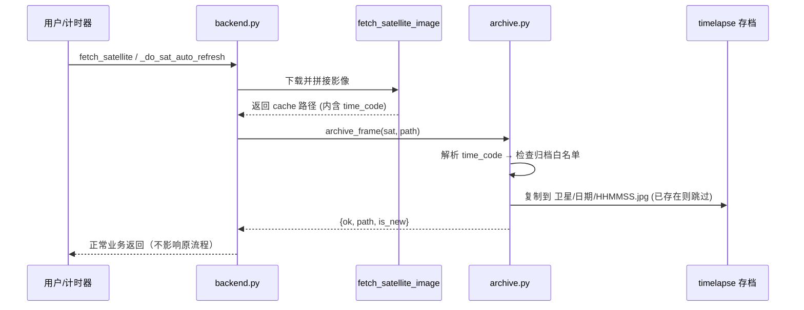
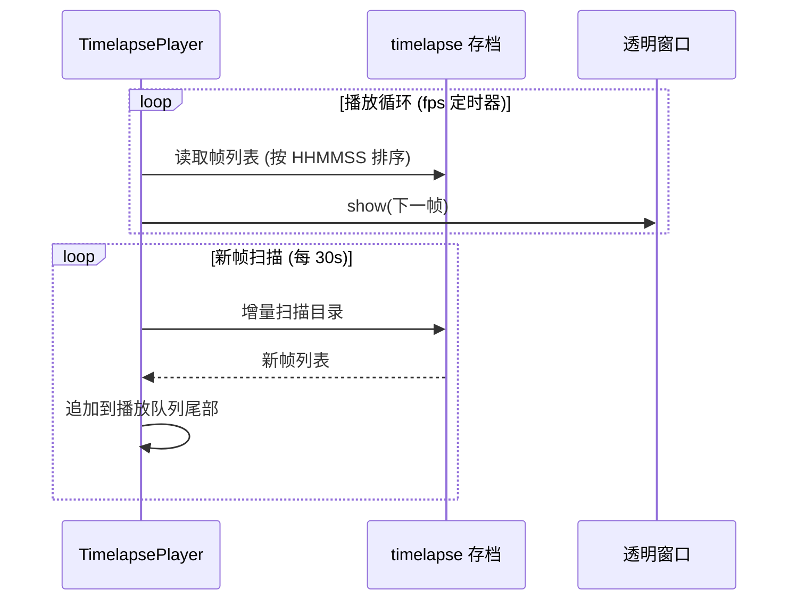

# 「时间流逝」模块详细设计文档

> RealEarth v2.1 新增模块 · 卫星影像归档 / 浏览 / 动态壁纸 / 回填 / 导出
> 状态：设计稿（待用户确认后进入实现）
> 日期：2026-08-24

---

## 1. 概述

### 1.1 目标

把卫星影像从「只存不管理」升级为**可积累、可浏览、可播放、可回填**的时间序列资产：

1. **自动归档**：用户选择的卫星，每次获取的影像自动按天归档（10 分钟/帧，全分辨率）
2. **浏览**：左侧新增「时间流逝」入口，按 卫星 → 日期 → 帧序列 三级浏览，日历高亮有数据的日期
3. **动态壁纸**：透明置底窗口循环播放当日/历史帧序列，**实时模式**下新帧落盘即入队
4. **历史回填**：从 RAMMB 历史数据源补齐过去错过的时段
5. **导出**：一键生成 MP4 / GIF，可保存分享

### 1.2 范围

| 包含 | 不包含（本期） |
|------|---------------|
| 6 颗地球静止卫星（Himawari-8 / GOES-16 / GOES-18 / GK2A / Meteosat 0° / Meteosat-9） | SDO 太阳观测（无连续时间序列缓存，暂不纳入） |
| 自然色 natural_color | geocolor 地球色可作为存档子集（默认同当前所选颜色） |
| 当天实时动态影像 | 跨天拼接动画（首版仅单日，多日导出可在阶段 3 扩展） |

### 1.3 术语

- **帧 (frame)**：一次获取的完整卫星影像，以拍摄时刻 `time_code`（`YYYYMMDDHHMMSS`）唯一标识
- **存档目录 (archive)**：`~/.nasa_wallpaper/timelapse/`，与现有 `cache/` 解耦的规范化存储
- **播放器 (player)**：常驻透明置底窗口，负责按时间顺序循环渲染帧序列

---

## 2. 现状与关键发现（事实依据）

现有代码逐项核对结果：

| 项目 | 现状 | 对本模块的意义 |
|------|------|---------------|
| 卫星缓存路径 | `~/.nasa_wallpaper/cache/satellite/{satellite}_{color}_{scale}_{time_code}.jpg` | **文件名已含精确时间戳**，素材一直在积累 |
| 采集链路 | web 版（main.py）只有 `backend.py` 的 10 分钟计时器（`_do_sat_auto_refresh`）；`scheduler.py` 仅旧版 `main_ctk.py` 使用 | 归档接入点 = `fetch_satellite`（手动）+ `_do_sat_auto_refresh`（自动）+ `check_and_update_satellite`（兼容） |
| 最新时间戳获取 | `providers/geostationary.py::_get_time_code` 读 `latest_times.json`，**只取 `timestamps_int[0]`** | 数组本身可能含历史时间戳 → 回填的天然数据源（待实测 V1） |
| 瓦片拼接 | `fetch_satellite_image()` 按 scale 并行下载瓦片 → PIL 拼接 → JPEG 存缓存 | 回填复用同一套拼接逻辑即可 |
| 壁纸链路 | `set_wallpaper(path, key, style, pos_x, pos_y, scale)` 写注册表 + SystemParametersInfoW | 动态壁纸不经过此链路（独立播放器窗口） |
| 前端结构 | 3 个 `nav-item`（apod/satellite/sdo）+ 3 个 `panel`；pywebview 桥接 `window.pywebview.api.*` | 新增第 4 个 nav-item + panel，走既有 `switchSource` 模式 |
| 桥接约束 | `Api` 类（main.py）包装 `RealEarthBackend`；`init()` 返回 `get_initial_state()` | 新 API 一律加在 Backend + Api 双层，`get_initial_state` 追加 `timelapse` 字段 |

---

## 3. 总体架构



分层原则：

- **archive / backfill / player / export 均为独立模块**，只依赖 `config` 与 `providers`，不依赖 UI
- **播放内核与渲染后端解耦**：`RenderBackend` 只暴露 `show(frame_path) / close()`，换实现不影响上层
- **任务系统统一**：回填、导出都是后台任务，返回 `task_id`，前端轮询进度，支持取消

---

## 4. 目录结构设计

```
~/.nasa_wallpaper/
├── timelapse/                        # 新增：时间流逝存档（根）
│   └── {satellite_id}/               # 如 himawari / goes-16
│       └── {YYYY-MM-DD}/             # 按天归档
│           ├── {HHMMSS}.jpg          # 帧文件，时间戳命名（天然有序、天然去重）
│           └── manifest.json         # 可选：当天元数据（来源卫星/颜色/分辨率/帧数）
├── cache/satellite/                  # 现有：原始下载缓存（不动）
├── cache/sdo/                        # 现有
├── export/                           # 新增：导出的 MP4/GIF 输出目录
└── config.json                       # 现有，追加 timelapse_* 配置
```

**命名与去重规则**：

- 帧文件名 = RAMMB `time_code` 后 6 位（`HHMMSS`），即 `{time_code}.jpg`
- 归档时 `if target.exists(): skip` —— 天然幂等，重复获取/回填不会产生重复帧
- 同一天内若同一时刻出现两次不同内容（异常重试），以先落盘者为准

---

## 5. 数据流

### 5.1 归档链路（采集 → 存档）



要点：

1. **归档是旁路动作**，失败绝不阻塞原获取/设壁纸流程（try/except 包裹）
2. **白名单过滤**：只有 `config["timelapse_archive_sats"]` 里的卫星才归档（用户决策 #3）
3. 手动获取与自动刷新共用同一入口，一次获取只归档一次

### 5.2 实时播放链路（存档 → 动态壁纸）



**实时语义**：播放队列 = 「今天第 1 帧 → 刚刚的帧」循环。帧数随当日时间增长，**延迟 ≤ 10 分钟**（跟随采集节奏）。帧数不足（< 8 帧）时自动降速到 `low_fps` 并加过渡效果，避免闪烁。

---

## 6. 核心组件设计

### 6.1 `archive.py` — 归档模块

```python
TIMELAPSE_DIR = APP_DIR / "timelapse"

def archive_frame(satellite: str, image_path: str, time_code: str) -> dict:
    """归档一帧影像。幂等：已存在则跳过。
    返回 {ok, path, is_new, sat, date, time}
    """

def get_archive_sats() -> list[str]:
    """当前启用归档的卫星列表 (读 config)"""

def set_archive_sat(satellite: str, on: bool):
    """增删归档白名单"""

def list_days(satellite: str) -> list[dict]:
    """返回该卫星全部有数据的日期: [{date, frames, size_mb}]"""

def list_frames(satellite: str, date: str) -> list[dict]:
    """返回某天全部帧: [{time, path, size}]"""

def delete_days(satellite: str, dates: list[str]) -> int:
    """删除指定日期目录，返回删除帧数"""

def storage_stats() -> dict:
    """按卫星/日期统计磁盘占用，供清理界面"""
```

**接入点改造**（3 处，均为 2~3 行改动）：

- `backend.py::fetch_satellite`：拿到 `path` 后解析 `time_code` 调 `archive_frame`
- `backend.py::_do_sat_auto_refresh`：同上
- `scheduler.py::check_and_update_satellite`：同上（兼容旧界面）
- `geostationary.py::fetch_satellite_image` 增加返回值 `time_code`（或新增 `get_time_code(path)` 从文件名解析——推荐后者，改动最小）

### 6.2 `backfill.py` — 历史回填

```python
def backfill(satellite: str, start: date, end: date, color: str,
             target_size: int, task_id: str) -> None:
    """后台任务：遍历目标时段内所有时间戳，逐帧下载拼接 → archive_frame
    进度经 TaskManager 记录；已有帧跳过（断点续传）
    """

def list_remote_times(satellite: str, color: str, day: date) -> list[int]:
    """查询 RAMMB 某天可用时间戳列表"""
```

**数据源策略**（依赖实测验证）：

- 优先：`latest_times.json` 的 `timestamps_int` 全量数组（若含历史则一次拿全）
- 否则：按天查询 RAMMB 时间戳索引（`/data/json/{sat}/full_disk/{color}/times.json` 或按日期的 URL 模式）
- 瓦片拼接：直接复用 `geostationary.py` 的 `_calc_scale` + 瓦片下载循环，重构出 `fetch_satellite_image_at(satellite, color, target_size, time_code)` 支持**指定时刻**（现有函数只支持"最新"）

**防抖与限速**：批量下载间隔 200ms；单帧失败重试 2 次后跳过并记录；`cancel_task` 置位后线程优雅退出。

### 6.3 `timelapse_player.py` — 动态壁纸播放器（核心）

```python
class FrameSource:
    """帧列表维护：全量扫描 + 增量刷新 (last_mtime 记忆)"""

class TimelapsePlayer:
    """播放内核：fps 定时器、循环、暂停/恢复、低帧数降速
       ├── start(sat, date, fps)      # 启动播放 + 创建渲染后端
       ├── stop()                     # 停止播放 + 关闭窗口
       ├── pause() / resume()
       └── state() -> {running, sat, date, frames, fps, last_frame_time}
    """

class RenderBackend(ABC):
    """渲染后端接口，两种实现：
       show(frame_path) / close()
    """
```

**渲染后端 A（首选）：pywebview 透明第二窗口**

- `webview.create_window("__timelapse__", timelapse_player.html, transparent=True, frameless=True, easy_drag=False)`，窗口尺寸 = 屏幕尺寸，位置 (0,0)
- HTML 为纯黑背景 + `` 轮播：JS 端 `setInterval` 按 fps 换帧，帧用 `file://` 或后端传 data URI
- 窗口启动后做 Win32 置底与无激活处理：
  ```python
  hwnd = window.native.handle
  SetWindowLong(hwnd, GWL_EXSTYLE, WS_EX_NOACTIVATE | WS_EX_TOOLWINDOW | WS_EX_LAYERED)
  SetWindowPos(hwnd, HWND_BOTTOM, 0, 0, sw, sh, SWP_NOACTIVATE)
  SetParent(hwnd, Progman下的SHELLDLL_DefView)  # 尝试挂到桌面层
  ```
- 周期性（如每 5s）`SetWindowPos(HWND_BOTTOM)` 防止被其他窗口覆盖到顶层（Wallpaper Engine 同款做法）
- 主窗口（控制面板）与播放窗口**同进程共存**，pywebview 多窗口由同一 `webview.start()` 驱动

**渲染后端 B（备选）：纯 Win32 分层窗口**

- `UpdateLayeredWindow` + PIL 渲染，每帧 `UpdateLayeredWindow(hwnd, dc, ..., image_bitmap)`，性能最优、可控性最强
- 实现量较大，作为后端 A 失败时的降级方案（接口已预留，可平滑替换）

**性能约定**：

- 帧图在上屏前缩放到屏幕分辨率并转 BMP 缓存，避免每帧重复解码 JPEG
- 播放器占用目标：CPU < 3%，内存 < 200MB（1080p 屏幕）

### 6.4 `export.py` — 导出

```python
def export_timelapse(satellite, start, end, fmt="mp4", fps=10,
                     interval=1, task_id) -> str | None:
    """从存档帧序列合成视频/动图，输出到 ~/.nasa_wallpaper/export/
    支持 mp4 (imageio-ffmpeg) / gif (Pillow)
    """
```

- **GIF**：Pillow `save(..., save_all=True, append_images=..., duration=1000/fps, loop=0)`，零新增依赖
- **MP4**：`imageio-ffmpeg` 自带静态 ffmpeg 二进制（打包体积 +~25MB），不依赖系统安装 ffmpeg
- `interval` 参数：抽帧间隔（1=全部，2=隔一取一），用于控制导出体积
- 导出进度 = 已编码帧数 / 总帧数；支持取消

### 6.5 任务系统 `tasks.py`

```python
class TaskManager:
    """后台任务注册表
    submit(fn, *args) -> task_id
    progress(task_id) -> {running, pct, current, total, msg}
    cancel(task_id)
    """
```

- 单例，内存态即可（进度不落盘）
- 回填/导出共用一个管理器，前端 `setInterval` 轮询

---

## 7. 后端 API 契约

全部经 `Api` 桥接暴露，返回 JSON 可序列化对象。`get_initial_state()` 追加 `timelapse` 字段（卫星归档状态、今日实时帧数、播放器运行状态）。

| API | 参数 | 返回 | 说明 |
|-----|------|------|------|
| `get_timelapse_overview` | — | `{sats:[{id,name,days,frames,size_mb}], total:{frames,size_mb}}` | 面板首页统计 |
| `get_timelapse_days` | `sat` | `[{date, frames, size_mb}]` | 日历高亮数据源 |
| `get_timelapse_frames` | `sat, date, thumb?` | `[{time, url, size}]` | 帧列表；thumb=1 返回小图 data URI |
| `set_archive_sat` | `sat, on` | `{ok, archive_sats}` | 归档白名单开关 |
| `get_live_state` | — | `{running, sat, date, frames, fps, last_time}` | 播放器状态 |
| `start_live_wallpaper` | `sat, date?, fps?` | `{ok, frames}` | date 缺省=今天；已运行则重启 |
| `stop_live_wallpaper` | — | `{ok}` | 停止并关窗 |
| `backfill` | `sat, start, end` | `{ok, task_id}` | 启动回填任务 |
| `export_timelapse` | `sat, start, end, fmt, fps?, interval?` | `{ok, task_id}` | 启动导出任务 |
| `get_task_progress` | `task_id` | `{running, pct, current, total, msg}` | 轮询进度 |
| `cancel_task` | `task_id` | `{ok}` | 取消任务 |
| `delete_days` | `sat, dates[]` | `{ok, deleted}` | 手动删除日期 |
| `get_storage_stats` | — | `{sats:[{id, days:[{date,frames,size}]}], total_mb}` | 存储管理视图 |

**播放器生命周期钩子**：

- `quit_app()` 中追加 `stop_live_wallpaper()`（防残留窗口）
- 动态壁纸运行期间，静态 `set_wallpaper` 调用不受影响（互不干扰，动态壁纸不写注册表）

---

## 8. 前端 UI 设计

### 8.1 导航

左侧 `nav-list` 追加第 4 项（放在「太阳观测」之后）：

```html
<div class="nav-item" data-source="timelapse" style="--nav-accent:#22C55E;--nav-glow:rgba(34,197,94,.25);--nav-accent-bg:rgba(34,197,94,.15)">
  <span class="nav-icon"><!-- 时钟/胶片 SVG --></span>
  <span class="nav-label">时间流逝</span>
  <span class="nav-badge" id="tl-live-badge">实时</span>
</div>
```

强调色选用绿色系（与 紫/蓝/橙 区分）。`switchSource` 增加 `timelapse` 分支，`set_source` 后端校验白名单加 `"timelapse"`。

### 8.2 面板布局

```
┌──────────────────────────────────────────────────────────┐
│  ◉ 时间流逝 · 卫星影像动态回放                [实时 ● 运行中] │
├──────────────────────────────┬───────────────────────────┤
│ 控制区                        │ 播放器预览区               │
│  卫星 ▾ (6 颗)                │ ┌───────────────────────┐ │
│  日期 [选择器][今日][日历]      │ │  canvas 循环播放       │ │
│  归档开关 [himawari ✓]        │ │  ⏵/⏸ 12/144 · 帧间隔  │ │
│  ─────────────────            │ └───────────────────────┘ │
│  设为动态壁纸  [开始]          │ 帧缩略图时间轴 (横向滚动)   │
│  导出 [MP4][GIF]              │  ▎▎▎▎▎▎▎▎▎▎▎▎▎▎▎▎  (点击跳转) │
│  回填 [起][止][开始]           │                          │
│  ─────────────────            │                          │
│  存储: 3.2 GB / 24 天 / 保留30 │                          │
└──────────────────────────────┴───────────────────────────┘
```

- **日历**：复用现有模态框样式，日期格有数据则高亮 + 显示帧数角标
- **实时徽标**：`get_live_state().running` 为真时在面板头显示绿色「实时」脉冲点
- **预览播放**：canvas 或 img 轮播（与播放器共用一套帧渲染 JS），fps 滑块即时生效
- **任务进度**：回填/导出期间底部显示进度条（轮询 `get_task_progress`），可取消
- 缩略图墙按需懒加载（`IntersectionObserver`），避免一次性传几百张 data URI

### 8.3 交互流程

1. 进入面板 → `get_timelapse_overview` → 默认选中已归档卫星 + 最新有数据日期 → `get_timelapse_frames` 渲染时间轴
2. 选日期 → 加载该天帧 → 自动开始预览播放
3. 点「设为动态壁纸」→ `start_live_wallpaper(sat, date?)` → 徽标亮起；再点变「停止」
4. 点「导出」→ 弹格式/帧率/抽帧选择 → `export_timelapse` → 进度条 → 完成后提示输出路径（`explorer /select` 打开）
5. 点「回填」→ 起止日期（默认近 7 天）→ `backfill` → 进度条

---

## 9. 配置项（config.py 追加）

```python
"timelapse_archive_sats": [],        # 归档白名单（空=不归档任何卫星）
"timelapse_live_sat": None,          # 动态壁纸卫星（None=未启用）
"timelapse_live_date": None,         # None=跟随今天
"timelapse_fps": 10,                 # 播放帧率
"timelapse_low_fps": 3,              # 低帧数(<8)时降速
"timelapse_scan_interval": 30,       # 新帧扫描间隔（秒）
"timelapse_keep_days": 0,            # 0=永久保留；N=自动清理 N 天前
"timelapse_export_dir": "",          # 空= ~/.nasa_wallpaper/export
```

默认值原则：**不破坏现有行为**（归档默认关闭，用户勾选某卫星后开启）。

---

## 10. 依赖与打包影响

| 新增依赖 | 用途 | 体积影响 | 决策 |
|---------|------|---------|------|
| imageio-ffmpeg | MP4 编码（自带静态 ffmpeg） | +~25MB | 阶段 3 引入，GIF 先行（零依赖） |
| （无） | 播放器/归档/回填 | 0 | 全部用标准库 + Pillow + pywebview 现有能力 |

- 打包 spec 需追加：`timelapse_player.html`、`export/` 模板资源
- exe 体积预计 24MB → ~26MB（阶段 3 后 ~49MB）
- 播放器窗口的 `transparent` 依赖 pywebview 的 EdgeChromium 后端（当前默认，无额外改动）

---

## 11. 边界与风险

| 风险 | 等级 | 缓解 |
|------|------|------|
| pywebview 透明窗口置底行为未经实测（V3） | 高 | 渲染后端接口化，备选 Win32 分层窗口方案已设计 |
| 动态壁纸常驻内存/CPU | 中 | 性能约定（CPU<3%/内存<200MB）+ 帧图缓存 + 低帧数降速 |
| RAMMB 历史时间戳接口形态未知（V1/V2） | 中 | 先实测 `latest_times.json` 数组长度，再定回填实现 |
| 10 分钟间隔云图跳变明显 | 低 | 用户已接受 10min/帧；低帧率过渡 + fps 可调 |
| 磁盘增长（一天 144 帧 × ~1MB） | 低 | 保留天数策略 + 存储管理界面 |
| 打包后透明窗口依赖 WebView2 运行时 | 低 | 现有应用已依赖 WebView2（pywebview 默认） |

---

## 12. 开发排期

| 阶段 | 内容 | 交付物 | 验证标准 |
|------|------|--------|---------|
| **阶段 1** | archive.py + backend 归档接入 + API + 前端面板（浏览/预览播放/归档开关） | 可浏览历史影像的「时间流逝」面板 | 手动获取一帧 → 出现在面板当天时间轴 |
| **阶段 2** | timelapse_player.py（渲染后端 A）+ 实时模式 + 置底处理 | 实时动态壁纸 | 启动后桌面出现动态影像，新帧 10min 内入队 |
| **阶段 3** | backfill.py + export.py + 存储管理 + 打包 | 完整功能 | 回填补出历史天；导出 MP4/GIF 可播放 |

预计每阶段独立可测、可交付，阶段 1 不阻塞 2/3。

---

## 13. 待实测验证点（进入实现前）

- **V1**：请求 `https://rammb-slider.cira.colostate.edu/data/json/himawari/full_disk/natural_color/latest_times.json`，确认 `timestamps_int` 数组长度 —— 决定回填是"一次拿全"还是"逐日查询"
- **V2**：探测 RAMMB 是否有按日期的历史时间戳索引（`times.json` 系列 URL 模式）
- **V3**：pywebview `transparent=True` 第二窗口在 EdgeChromium 下的透明效果、置底（SetParent Progman）、多窗口共存 —— 决定渲染后端 A 可行性
- **V4**：实际攒 20+ 帧后预览 10fps 播放观感，确定是否需要插帧
- **V5**：确认 `fetch_satellite_image` 缓存文件名中 time_code 与 RAMMB `timestamps_int` 的格式一致性（`%Y%m%d%H%M%S`）
